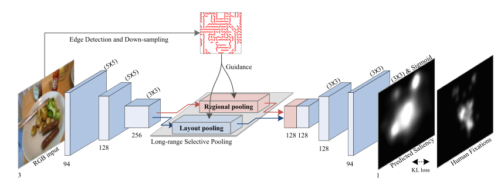

# [Contour-guided Saliency Detection with Long-range Interactions](https://www.sciencedirect.com/science/article/pii/S0925231222002661)

## 1. Introduction
* We explore the role of line drawings in visual searching;
* Propose a robust light-weight saliency detection network.
  

## 2. How to use
### 2.1 Train model
* install:
```
 numpy
 pytorch 0.4+
 apex (https://github.com/NVIDIA/apex)
 opencv3
```
* set your paths in ``train_edgenet_lrsp.py``; (including ``datapath``,``savepath``,``ck_imgpath``, etc.)
* run ``train_edgenet_lrsp.py``
  
### 2.2 Test
* set your paths in ``test_edgenet_lrsp.py``, model is in (.\ckpts\edgenet\salient_rgb_model_sharewgt_50.pth)
*  run ``test_edgenet_lrsp.py``

## 3. Cite this work
```@article{peng2022contour,
  title={Contour-guided saliency detection with long-range interactions},
  author={Peng, Peng and Yang, Kai-Fu and Liang, Si-Qin and Li, Yong-Jie},
  journal={Neurocomputing},
  volume={488},
  pages={345--358},
  year={2022},
  publisher={Elsevier}
}
```